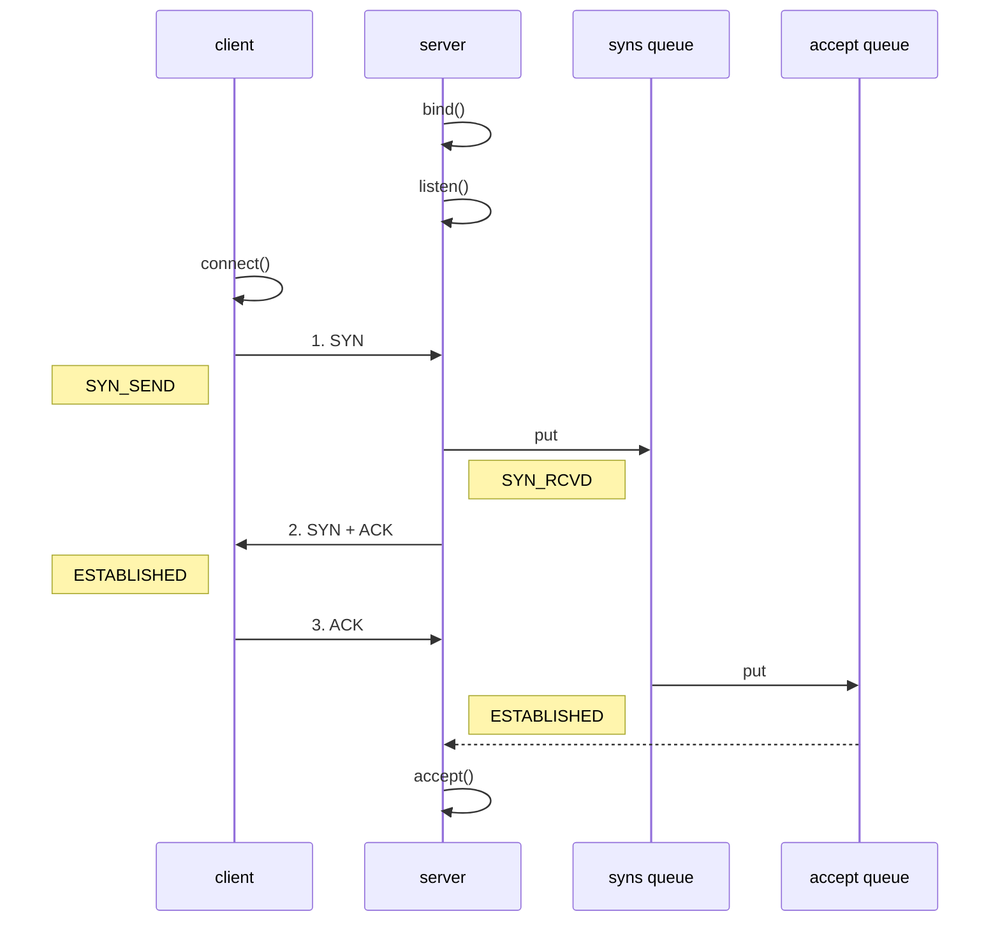

# 计算机网络

## 1. OSI七层模型

- **第一层：应用层。**定义了用于在网络中进行通信和传输数据的接口。
- **第二层：表示层。**定义不同的系统中数据的传输格式，编码和解码规范等。
- **第三层：会话层。**管理用户的会话，控制用户间逻辑连接的建立和中断。
- **第四层：传输层。**管理着网络中的端到端的数据传输。
- **第五层：网络层。**定义网络设备间如何传输数据。
- **第六层：链路层。**将上面的网络层的数据包封装成数据帧，便于物理层传输。
- **第七层：物理层。**这一层主要就是传输这些二进制数据。


实际应用过程中，五层协议结构里面是没有表示层和会话层的。应该说它们和应用层合并了。

我们应该将重点放在应用层和传输层这两个层面。因为 HTTP 是应用层协议，而 TCP 是传输层协议。

## 2. TCP和UDP区别

UDP：无连接，数据传输不可靠，数据传输不受流量控制，不保证消息的顺序性，连接对象支持一对一，一对多，多对多的，首部开销较少，以报文的方式进行传输，适用于实时应用（IP电话，视频会议，直播等）

TCP：有链接的，数据传输可靠，数据传输受流量控制，消息的顺序受保证，连接对象仅支持一对一，以字节流的形式进行传输，首部开销最小20字节，最大60字节，适用于可靠传输的应用，如文件传输，http/https。

TCP应用于可靠传输的情况，UDP用于高速传输和实时性有较高要求的通信。

## 3. Tcp的三次握手




sync queue 表示半连接队列，accept queue 表示全连接队列。

1. 第一次握手：客户端请求建立连接，向服务端发送一个同步报文（SYN=1），同时选择一个随机数 seq = x 作为初始序列号，客户端状态修改为 SYN_SEND，等待服务器确认
2. 第二次握手：：服务端收到连接请求报文后，如果同意建立连接，服务器进入SYN_RECV状态,并将该请求放入 sync queue 队列，向客户端发送同步确认报文（SYN=1，ACK=1），确认号为 ack = x + 1，同时选择一个随机数 seq = y 作为初始序列号
3. 第三次握手：客户端收到服务端的确认后，状态改为ESTABLISHED状态，向服务端发送一个确认报文（ACK=1），确认号为 ack= y + 1，序列号为 seq = x + 1，服务器收到后，将该请求从 sync queue 放入 accept queue，服务器进入ESTABLISHED状态，完成三次握手

三次握手，发生在accept之前。

服务端进行accept的时候，可能忙不过来，因此使用队列，拿一个处理一个。

## 4. 为什么是三次握手而不是两次

如果只有两次，客户端发送后，服务端接受后响应给客户端

1. 防止已过期的连接请求报文突然又传送到服务器，因而产生错误和资源浪费。

   A发送连接，因为网络原因，连接未到达服务器，客户端A长时间未接收到服务端响应，客户端关闭。此时连接到达了服务端，服务端向客户端发起确认，结果客户端已关闭，造成服务端长时间等待，消耗资源

2. 三次握手能让双方均确认自己和对方的发送和接受能力都正常。

   第一次握手：客户端发送报文，什么都无法确认，服务端收到后，可以确认自己接受和对方发送正常。

   第二次握手：客户端可以确认自己发送和接受正常，对方发送正常。

   第三次握手：服务端可以确认自己发送和对方的发送接收都正常。

3.  告知对方自己的初始序号值，并确认收到对方的初始序号值。

   TCP 实现了可靠的数据传输，原因之一就是 TCP 报文段中维护了序号字段和确认序号字段，通过这两个字段双方都可以知道在自己发出的数据中，哪些是已经被对方确认接收的。这两个字段的值会在初始序号值得基础递增，如果是两次握手，只有发起方的初始序号可以得到确认，而另一方的初始序号则得不到确认。

## 5. 为什么三次握手而不是四次

因为三次握手已经可以确认双方的发送接收能力正常，双方都知道彼此已经准备好，而且也可以完成对双方初始序号值得确认，也就无需再第四次握手了。

## 6. SYN洪泛攻击

SYN洪泛攻击属于 DOS 攻击的一种，它利用 TCP 协议缺陷，通过发送大量的半连接请求，耗费 CPU 和内存资源。

在第二次握手中，服务器收到客户端请求后，状态改为SYN_RECV，并将连接放入半连接队列，之后向客户端发送第二次握手，但是如果客户端的IP是虚拟的，此时服务端请求就到达不了客户端，导致服务器不断进行重发，等待客户端确认直至超时。

这些伪造的SYS包长时间占用半连接队列，影响正常的SYN，导致服务器运行缓慢，网络堵塞甚至系统瘫痪。

防范：

1. 通过防火墙、路由器等过滤网关防护。
2. 通过加固 TCP/IP 协议栈防范，如增加最大半连接数，缩短超时时间。

3. SYN cookies技术。SYN Cookies 是对 TCP 服务器端的三次握手做一些修改，专门用来防范 SYN洪泛攻击的一种手段。

## 7. 三次握手连接阶段，最后一次ACK丢包怎么办。

服务端：

1. ACK在网络中丢失，此时客户端处于syn_recv状态，会根据TCP的超时重试机制，等待3，6，12s后重新发送SYN+ACK，便于客户端重新发送ACK包
2. 如果重发指定次数之后，还未接收到ACK应答，一段时间后，服务端自动关闭这个链接

客户端：

客户端认为这个连接已经建立，如果客户端向服务端发送数据，服务端将以RST包（Reset，标示复位，用于异常的关闭连接）响应。此时，客户端知道第三次握手失败。

### 8. 四次挥手


1. 第一次：客户端向服务端发送释放报文（FIN=1,ACK=1），主动关闭连接，同时等待服务端确认。

   序列号 seq = u：客户端上次发送的报文的最后一个字节的序号 + 1

   确认号 ack = k：即服务端上次发送的报文的最后一个字节的序号 + 1

2. 第二次：服务端收到连接释放报文后，立即发出确认报文（ACK=1），序列号 seq = k，确认号 ack = u + 1。

   这时 TCP 连接处于半关闭状态，即客户端到服务端的连接已经释放了，但是服务端到客户端的连接还未释放。这表示客户端已经没有数据发送了，但是服务端可能还要给客户端发送数据。

3. 第三次：服务端向客户端发送连接释放报文（FIN=1，ACK=1），主动关闭连接，同时等待 客户端的确认。

   序列号 seq = w，即服务端上次发送的报文的最后一个字节的序号 + 1。

   确认号 ack = u + 1，与第二次挥手相同，因为这段时间客户端没有发送数据

4. 第四次：客户端收到服务端的连接释放报文后，立即发出确认报文（ACK=1），序列号 seq =u + 1，确认号为 ack = w + 1。

此时，客户端就进入了 TIME-WAIT 状态。注意此时客户端到 TCP 连接还没有释放，必须经过2*MSL（最长报文段寿命）的时间后，才进入 CLOSED 状态。而服务端只要收到客户端发出的确认，就立即进入 CLOSED 状态。可以看到，服务端结束 TCP 连接的时间要比客户端早一些。

## 8. 为什么连接三次，关闭四次

服务器在收到客户端的 FIN 报文段后，可能还有一些数据要传输，所以不能马上关闭连接，但是会做出应答，返回 ACK 报文段.

在数据发送完后，服务器会向客户单发送 FIN 报文，表示数据已经发送完

毕，请求关闭连接。服务器的**ACK**和**FIN**一般都会分开发送，从而导致多了一次，因此一共需要四次挥手。

### 9. 为什么客户端的 **TIME-WAIT** 状态必须等待 **2MSL** 

1. 确保 ACK 报文能够到达服务端，从而使服务端正常关闭连接。

   挥手时，ACK报文不一定到达服务端。如果超时，服务端会超时重传 FIN/ACK

   报文，此时如果客户端已经断开了连接，那么就无法响应服务端的二次请求，这样服务端迟迟收不到 FIN/ACK 报文的确认，就无法正常断开连接。

2. 防止已失效的连接请求报文段出现在之后的连接中。

   TCP 要求在 2MSL 内不使用相同的序列号。客户端在发送完最后一个 ACK 报文段后，再经过时间2MSL，就可以保证本连接持续的时间内产生的所有报文段都从网络中消失。

## 10. 建立了连接，客户端故障或丢包怎么办？

通过定时器 **+** 超时重试机制，尝试获取确认，直到最后会自动断开连接。

TCP 设有一个保活计时器。服务器每收到一次客户端的数据，都会重新复位这个计时器，时间通常是设置为 2 小时。若 2 小时还没有收到客户端的任何数据，服务器就开始重试：每隔 75 分钟发送一个探测报文段，若一连发送 10 个探测报文后客户端依然没有回应，那么服务器就认为连接已经断开了。

## **11. TIME-WAIT** 状态过多会产生什么后果？怎样处理？

从服务器来讲，短时间内关闭了大量的Client连接，就会造成服务器上出现大量的TIME_WAIT连接，严重消耗着服务器的资源，此时部分客户端就会显示连接不上。

从客户端来讲，客户端TIME_WAIT过多，就会导致端口资源被占用，因为端口就65536个，被占满就会导致无法创建新的连接。

1. 服务器可以设置 SO_REUSEADDR 套接字选项来避免 TIME_WAIT状态，此套接字选项告诉内核，即使此端口正忙（处于TIME_WAIT状态），也请继续并重用它

2. 调整系统内核参数，修改/etc/sysctl.conf文件，即修改 net.ipv4.tcp_tw_reuse 和

   tcp_timestamps

   ```xml
   net.ipv4.tcp_tw_reuse = 1 表示开启重用。允许将TIME-WAIT sockets重新用于新的TCP连
   接，默认为0，表示关闭；
   net.ipv4.tcp_tw_recycle = 1 表示开启TCP连接中TIME-WAIT sockets的快速回收，默认为
   0，表示关闭。
   ```

3. 强制关闭，发送 RST 包越过TIME_WAIT状态，直接进入CLOSED状态。

## **12. TIME_WAIT** 是服务器端的状态**?**还是客户端的状态**?**

TIME_WAIT 是主动断开连接的一方会进入的状态，一般情况下，都是客户端所处的状态;服务器端一般设置不主动关闭连接。

TIME_WAIT 需要等待 2MSL，在大量短连接的情况下，TIME_WAIT会太多，这也会消耗很多系统资源。对于服务器来说，在 HTTP 协议里指定 KeepAlive（浏览器重用一个 TCP 连接来处理多个 HTTP 请求），由浏览器来主动断开连接，可以一定程度上减少服务器的这个问题。

## 13. tcp如何保证可靠性

TCP主要提供了检验和、序列号/确认应答、超时重传、滑动窗口、拥塞控制和 流量控制等方法实现了可靠性传输。

检验和：接收端可以检测出来数据是否有差错和异常，假如有差错就会直接丢弃TCP段，重新发送。

序列号/确认应答：TCP传输的过程中，每次接收方收到数据后，都会对传输方进行确认应答。也就是发送ACK报文，这个ACK报文当中带有对应的确认序列号，告诉发送方，接收到了哪些数据，下一次的数据从哪里发。

滑动窗口：滑动窗口既提高了报文传输的效率，也避免了发送方发送过多的数据而导致接收方无法正常处理的异常。

超时重传：超时重传是指发送出去的数据包到接收到确认包之间的时间，如果超过了这个时间会被认为是丢包了，需要重传。最大超时时间是动态计算的。

拥塞控制：在数据传输过程中，可能由于网络状态的问题，造成网络拥堵，此时引入拥塞控制机制，在保证TCP可靠性的同时，提高性能。

流量控制：主机B通过告诉主机A自己接收缓冲区的大小，来使主机A控制发送的数据量。流量控制与TCP协议报头中的窗口大小有关。

## 14. 拥塞控制

四种算法

1. 慢开始 (slow-start)；
2. 拥塞避免 (congestion avoidance)；
3. 快速重传 (fast retransmit)；
4. 快速恢复 (fast recovery)。

发送方维持一个叫做拥塞窗口cwnd（congestion window）的状态变量。当cwndssthresh时，改用拥塞避免算法。

慢开始：不要一开始就发送大量的数据，由小到大逐渐增加拥塞窗口的大小。

拥塞避免：拥塞避免算法让拥塞窗口缓慢增长，即每经过一个往返时间RTT就把发送方的拥塞窗口cwnd加1而不是加倍。这样拥塞窗口按线性规律缓慢增长。

快重传：我们可以剔除一些不必要的拥塞报文，提高网络吞吐量。比如接收方在收到一个失序的报文段后就立即发出重复确认，而不要等到自己发送数据时捎带确认。快重传规定：发送方只要一连收到三个重复确认就应当立即重传对方尚未收到的报文段，而不必继续等待设置的重传计时器时间到期。

快恢复：主要是配合快重传。当发送方连续收到三个重复确认时，就执行“乘法减小”算法，把ssthresh门限减半（为了预防网络发生拥塞），但接下来并不执行慢开始算法，因为如果网络出现拥塞的话就不会收到好几个重复的确认，收到三个重复确认说明网络状况还可以。

## 15. Http常见状态码

200：成功

301/302：都表示重定向。301 代表永久性转移，302 代表暂时性转移

400：客户端请求语法有错误

403：服务器收到请求，但是拒绝服务

404：找不到请求的页面

500：失败

## 16.301和302

相同点：码都表示重定向，就是说浏览器在拿到服务器返回的这个状态码后会自动跳转到一个新的URL地址

不同点：

301表示旧地址A的资源已经被永久地移除了(这个资源不可访问了)，搜索引擎在抓取新内容的同时也将旧的网址交换为重定向之后的网址；

302表示旧地址A的资源还在（仍然可以访问），这个重定向只是临时地从旧地址A跳转到地址B，搜索引擎会抓取新的内容而保存旧的网址。 

## 17. Http请求方式


## 18.  **GET**请求和**POST**请求的区别？

使用上：

1. get使用url或者cookie传参，post将参数放入请求体中。
2. get提交的数据有长度限制，post数据可以非常大
3. post相比get安全，因为数据在地址栏不可见

本质区别：

GET和POST最大的区别主要是GET请求是幂等性的，POST请求不是。

### 19. **HTTP**长连接和短连接

**HTTP/1.0**：默认使用的是短连接。

浏览器和服务器每进行一次HTTP操作，就建立一次连接，但任务结束就中断连接。

**HTTP/1.1：**默认使用长连接。使用长连接，会在响应头加 Connection:keep-alive

在使用长连接的情况下，当一个网页打开完成后，客户端和服务器之间用于传输HTTP数据的 TCP连接不会关闭，如果客户端再次访问这个服务器上的网页，会继续使用这一条已经建立的连接。Keep-Alive不会永久保持连接，它有一个保持时间，可以在不同的服务器软件（如Apache）中设定这个时间。实现长连接要客户端和服务端都支持长连接。

**HTTP**协议的长连接和短连接，实质上是**TCP**协议的长连接和短连接。

## 20. Http请求报文和响应报文格式

请求报文：

1. 请求行（请求方法+URI协议+版本）

2. 请求头部

3. 空行

4. 请求主体

响应报文：

1. 状态行（版本+状态码+原因短语）

2. 响应首部

3. 空行

4. 响应主体

## 21. Http 不同版本区别

### 1.0和1.1

1. 长连接：1.1支持长连接，默认开启Connection： keep-alive. 1.0不支持长连接
2. 缓存处理：

# RPC

## 1. RPC和Http区别

[有了 HTTP 协议，为什么还要 RPC 协议，两者有什么区别？ - 腾讯云开发者社区-腾讯云 (tencent.com)](https://cloud.tencent.com/developer/article/1753834?from=article.detail.2088032)

1. RPC是传输层协议(4层).而HTTP协议是应用层协议(7层). 

2. RPC协议可以直接调用中立接口,HTTP协议不可以. 

3. RPC通信协议是长链接,HTTP协议一般采用短连接需要3次握手(可以配置长链接添加请求头Keep-Alive: timeout=20). (长连接，指在一个连接上可以连续发送多个数据包，在连接保持期间，如果没有数据包发送，需要双方发链路检测包。) 

4. RPC协议传递数据是加密压缩传输.HTTP协议需要传递大量的请求头信息.

5. RPC协议一般都有[注册中心](https://cloud.tencent.com/product/tse?from=10680).有丰富的监控机制.

