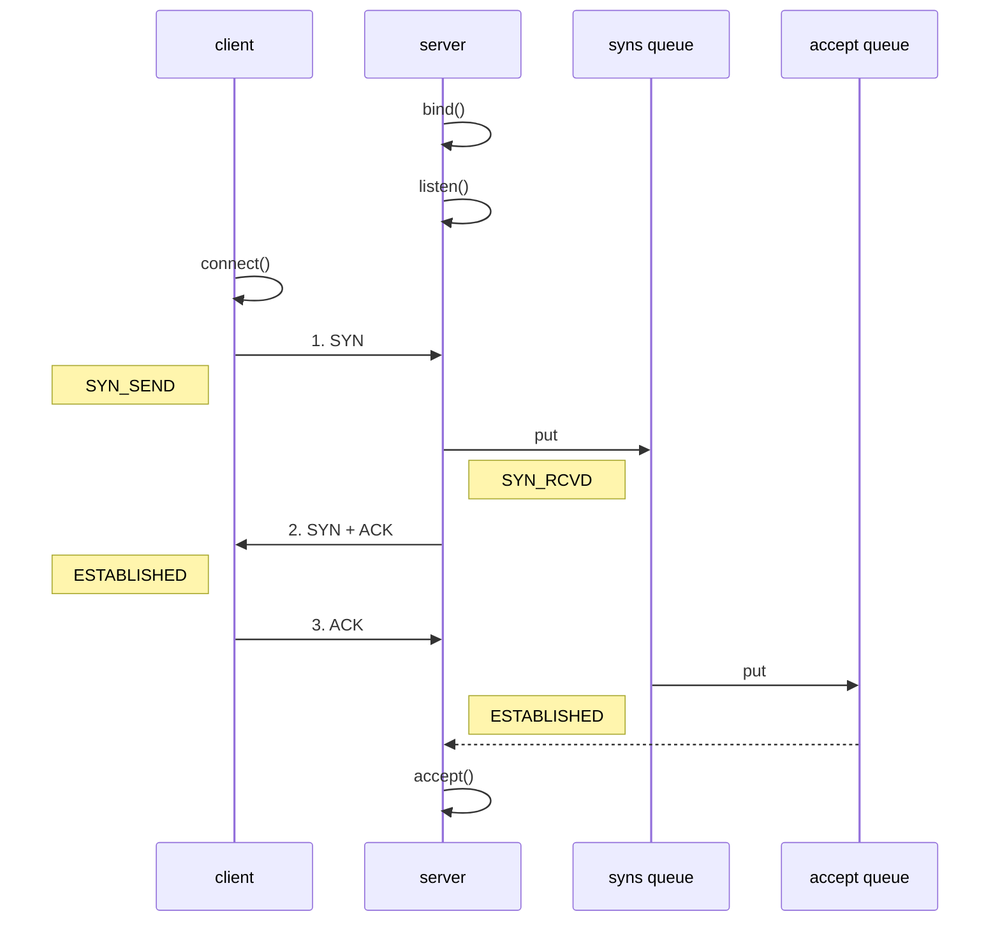

## 计算器网络

```mermaid
sequenceDiagram

participant c as client
participant s as server
participant sq as syns queue
participant aq as accept queue

s ->> s : bind()
s ->> s : listen()
c ->> c : connect()
c ->> s : 1. SYN
Note left of c : SYN_SEND
s ->> sq : put
Note right of s : SYN_RCVD
s ->> c : 2. SYN + ACK
Note left of c : ESTABLISHED
c ->> s : 3. ACK
sq ->> aq : put
Note right of s : ESTABLISHED
aq -->> s : 
s ->> s : accept()
```

[(186条消息) TCP半连接队列和全连接队列_库昊天的博客-CSDN博客_半连接队列](https://blog.csdn.net/yangguosb/article/details/90644683)